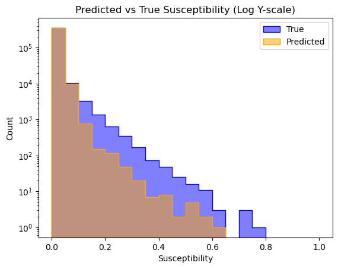

# Supervisor Meeting 

> Date: 17/04/2025 \
> Name: Jeremy Palmerio

## Recap of Thesis

The goal of this thesis is to produce a multi-hazard suscptibility map for all of Europe. 

**Multi-hazards susceptibility** mapping is a new framework for modelling the possible risks of an area to multiple hazards, accounting also for the interactions between hazards. 

The **input data** for this task are a set of 20 numpy arrays of shape (26 650 x 16 560) each representing one feature. The features are terrain, distance, atmospheric, land-use data. 

The **hazards** modelled in this study are: extreme winds, droughts, heatwaves, wildfires, floods, landslides, earthquakes, volcanos, (tsunamis).

Some hazards are modelled **statistically** like: extreme winds, droughts, heatwaves, earthquakes, volcanos, (tsunamis). These hazards' susceptibilty maps have already been generated.

While hazard with more complex dynamics are modelled using **deep learning** methods: wildfires, floods, landslides. For these hazards, historical data is also available as numpy arrays of the same format as the input maps. These encode the historical occurences of the respective hazards in each cell of the map. The historical data is used as a proxy for likelihood by using a min-max scaler, which is used as the label for the DL framework.

> What I am looking for with this meeting, is sanity checks that what I am doing makese sense or not. \
Also there are some details that are still fuzzy to me, and would like to hear your opinion on them. 

## Agenda
### General Idea
- The goal is to produce a map of the same dimension and resolution as the inputs (26 560 x 16 560) where each cell has the susceptibilty to a given single-hazard.
- This is inherently a pixelwise regression problem in computer vision. Possible architectures are thus UNet or SWIN transformers (or combination of both).

### Regression vs. Classification
- The problem at hand can be formulated in both ways. Either the likelihood is regressed for each cell (regression) or the likelihood is binarized using a threshold such that low vs high likelihood or none vs some likelihood are classified. For my supervisor and according to me it makese more sense to go for a regression, because the nuance in susceptibilites is very usefull for future applications (e.g. prioritizing high risk over medium risk zones), but the classification is much simpler as a problem. 

### Class? Imbalance
- If taken as a classification, there is always a strong imbalance in classes, for which case resampling is enough to correct as plenty of data is available. 
- However for regression, the imabalance is still there, but can't be thought of as binary imabalance. Instead there is a probability density which usually looks like a negative exponential. How to account for this to improve model performance ? Should the data be resampled such that the resulting density function is uniform? gaussian? \
Wildfire example below:

### Train-Test Splitting and Spatial Partitioning
- How do I perform spatial partitioning? The idea is to use a patch of size $N \times N$ centered on the cell to predict, and this is the input tensor given to the model. Does this make sense?
- How exaclty to split training and testing to avoid leakage, especially when doing spatial partioning ? Should there be no overlap whatsover between the patches?

### End to End vs. Pipeline 
- Current method is to produce single hazard maps using deep learning and statistical methods, then use these maps as inputs to a simple ensemble model for producing multi-hazard maps. 
- this is preferred by the supervisor because the standalone single hazard maps are usefull. 
- You've mentioned that end-to-end models are usually preferred, even in this case ?

### Negative vs. Hard Negative Examples
- There is some confusion in my mind surround negative examples. Imagine a two neighboring cells that have simallar surrounding cells but different labels. Is the cell with a low likelihood label a hard negative? Should this cell be used as a negative example even though it could be a high susceptibility cell?